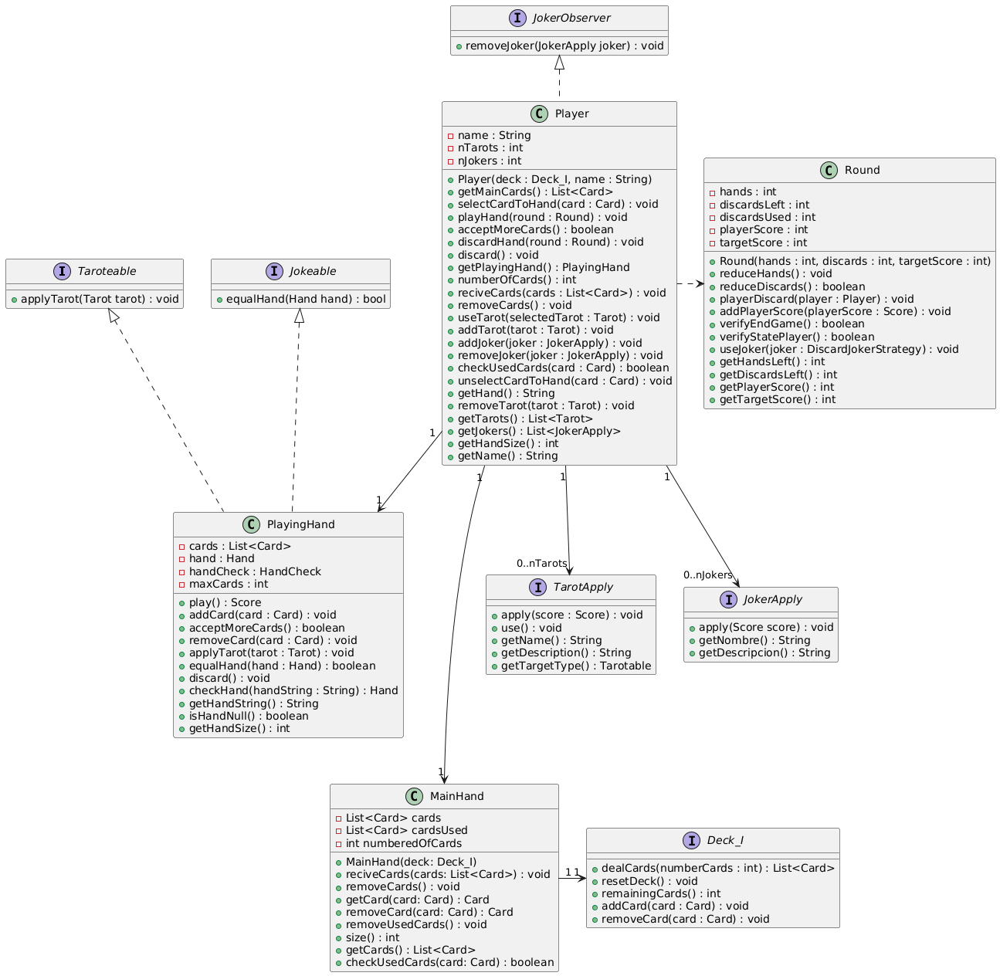
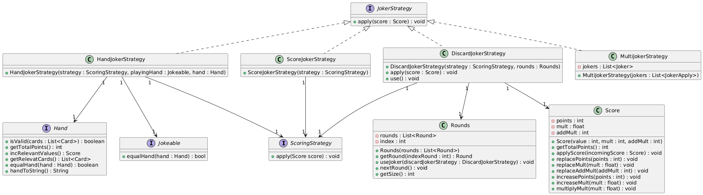
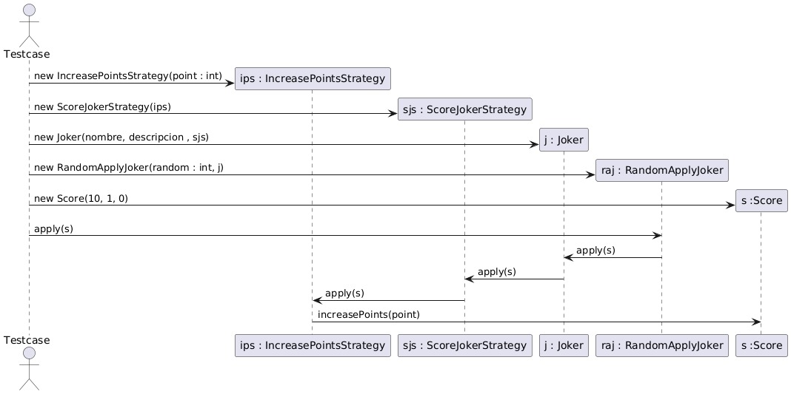

# Balatro Web — architectural migration of the Balatro Clone academic project

[](https://github.com/Valentino-Carmona/Balatro/actions/workflows/ci.yml)
[](https://codecov.io/gh/Valentino-Carmona/Balatro)

## 01. Overview

**Balatro is a poker-inspired deckbuilding roguelike.** This project reproduces its core game loop, including poker-hand evaluation, jokers, scoring, and shop/resource management.

**Academic Origin:** The core domain logic was developed in Java collaboratively by a team of 5 developers over 5 weeks (4 functional iterations) for the Algorithms and Programming III course, originally implemented as a monolithic desktop application with JavaFX.

**Individual Migration:** Subsequently, I individually migrated this monolithic desktop application to a distributed client-server architecture. My main goal was to migrate the business core to a Spring Boot Backend and expose it via a REST API consumed by a web client.

*For more details on the gameplay rules, mechanics, and interaction flows, refer to the [Gameplay Documentation](docs/GAMEPLAY.md).*

## 02. My Contributions

As part of the original team, my specific individual contributions included:

* **JokerStrategy & SOLID:** I proposed and implemented the `JokerStrategy` hierarchy using the Strategy Pattern (applying OCP) to encapsulate the variable behavior of jokers via the `apply()` method (`HandJokerStrategy`, `ScoreJokerStrategy`, `DiscardJokerStrategy`, and `MultiJokerStrategy`). I also actively participated in team design reviews to enforce SOLID principles.
* **Poker-hand evaluation:** I contributed to the algorithmic evaluation logic for poker hands (pairs, straights, flushes, full houses) and collaborated in the implementation of core classes such as `UtilsCheckHand`, `Hand`, `HandCheck`, `MainHand`, and `PlayingHand`.
* **Testing & CI:** Following a TDD/BDD approach, I implemented unit and integration tests to validate business rules, and configured the Continuous Integration (CI) pipeline using GitHub Actions.

## 03. Architecture

The project is designed under a **Client-Server** architecture model. My main technical focus in this adaptation resides in the Backend.

### 3.1. Backend (Java 11 / Spring Boot)
The migrated game domain resides in `/backend`, where the original business logic was adapted to Spring Boot and exposed through REST services. During the migration, the original domain was isolated (completely discarding the JavaFX visual layer), maintaining its core components (such as the JSON `Parser` used as data seed) and orchestrating them through HTTP endpoints.
* **Model and Services**: Decoupled structures and match flow orchestration.
* **Controllers**: REST API and request validation (e.g., `/api/v1/game/play`).
* **Security**: Spring Security configuration, HTTP security headers, CORS configuration, and dependency vulnerability analysis with OWASP Dependency-Check.

### 3.2. Frontend (React / TypeScript / Vite / Tailwind CSS)
The Frontend (`/frontend`) serves as a lightweight client that asynchronously consumes the API.
* The frontend delegates business rules to the server, which remains authoritative for game state and validation. 
* The API is stateless across requests, handling malformed requests coherently.

### 3.3. Core Domain (System Architecture)
The system core centralizes its state in the `Player` entity, which orchestrates the main game interactions (decks, hands, discards, and shop) agnostically to the presentation layer.



## 04. Design Deep Dive

### 4.1. JokerStrategy

For the implementation of the jokers' passive mechanics, I used the **Strategy Pattern**, applying the Open/Closed Principle (OCP), avoiding centralizing variable behaviors in conditionals and allowing the addition of new strategies without modifying the logic that consumes them.


<br>


## 05 Testing & Quality

The backend achieves **94% line coverage** and **82% branch coverage** with JaCoCo.

* **Unit Tests:** isolated testing of domain logic and services using Mockito.
* **Integration Tests:** validation of complete game flows across multiple components.
* **API Contract Tests:** verification of HTTP responses and security-related API behavior.
* **Architecture Tests:** validation of architectural constraints using ArchUnit.
* **Continuous Integration:** GitHub Actions automatically runs the Maven test and verification pipeline.
* **Security Analysis:** OWASP Dependency-Check is configured through Maven to audit project dependencies for known vulnerabilities.

## 06. Live Demo

🚀 **Play the live web version here:** 👉 [balatro-frontend.onrender.com](https://balatro-frontend.onrender.com)

> [!IMPORTANT]
> Because the project runs on Render's free tier, services may enter sleep mode. The first request after inactivity can take several seconds while the services wake up.

## 07. Quick Start

```bash
# Clone repository
git clone https://github.com/Valentino-Carmona/Balatro.git
cd Balatro

# Run with Docker
docker compose up --build
```
*(The frontend will be at `http://localhost:5173` and the API at `http://localhost:8080`)*.

*For a detailed setup guide, Docker-based test execution without local Maven, and troubleshooting, refer to the [Setup and Testing Guide](docs/RUNNING.md).*

## 08. Technical Details

### Environment Variables Configuration
* **Frontend (`VITE_API_URL`)**: HTTP requests base URL (e.g., `http://localhost:8080/api/v1`).
* **Backend (`CORS_ALLOWED_ORIGINS`)**: Allowed origins (e.g., `http://localhost:5173`).

### Local Development Environments
Backend:
```bash
cd backend
mvn spring-boot:run
```
Frontend:
```bash
cd frontend
npm install
npm run dev
```

### Running Tests
General testing and coverage report:
```bash
cd backend
mvn clean test jacoco:report
```
Security audit (SCA):
```bash
mvn dependency-check:check
```

## 09. Screenshots / UI

The project features a retro "Rubber Hose" aesthetic to offer an immersive visual casino experience.
* Animated felt background with dynamic gradient (`.table-bg-animated`).
* Interactive floating chips in orbit.
* Intuitive fan layout for cards and a statistics panel synchronized with the server.
* Visual feedback on key interactive components.
